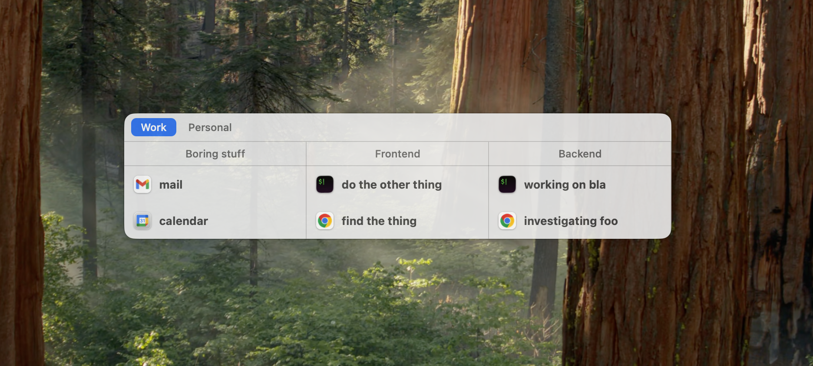

# WindowMap

A fast window picker for macOS. Organize windows into contexts (tabs) and workspaces (columns), switch between them quickly with keyboard, mouse, or trackpad.



## Why

You have 20+ windows open across multiple projects. Cmd+Tab cycles apps, not windows. Cmd+` cycles windows within an app but without context. Mission Control is a wall of thumbnails. WindowMap organizes your windows in contexts and workspaces that makes sense to you and let you switch in a few keystrokes.

## How it works

- **Contexts** group related workspaces (e.g., "Work" has Backend + Frontend + Docs)
- **Workspaces** group related windows (e.g., "Backend" has your editor + terminal + browser)
- Press a hotkey → picker shows your windows organized by workspace
- Navigate and select a window to focus it
- Window assignments persist across sessions

## Install

```sh
brew tap WindowMap/windowmap
brew trust windowmap/windowmap
brew install --cask windowmap
```

First launch: macOS may block the app — go to System Settings → Privacy & Security → "Open Anyway".

Grant permissions in System Settings → Privacy & Security:
1. **Accessibility** (required — hotkeys)
2. **Screen Recording** (optional — window previews)

## Quick start

| Action | Key |
|--------|-----|
| Open picker | `Opt+Space` |
| Navigate | Arrow keys or `i/k/j/l` |
| Focus window | `Enter` or `Space` |
| Quick switch | `Opt+Tab` (hold Opt, tap Tab to cycle, release to confirm) |
| New workspace | `Shift+N` |
| New context | `Cmd+N` |
| Move window | `M` then arrow keys |
| Rename | `R` |
| Close | `C` |
| Dismiss | `Escape` |

Trackpad: 3-finger swipe up to open, 3-finger swipe down to dismiss.

## Features

- **Window preview** — see a live preview of the selected window
- **Switcher** — `Cmd+Tab` replacement with a flat MRU list
- **App launcher** — press `N` to launch a new app window
- **Right-click menus** — context menus on windows, workspaces, and contexts
- **Drag and drop** — drag windows between workspaces, workspaces between contexts
- **URL handler** — set as default browser to route links through the picker
- **Hot-reload config** — edit `~/.config/windowmap/config.toml`, changes apply instantly

## Configuration

All settings in `~/.config/windowmap/config.toml`. The file is created on first install with sensible defaults. Every value is documented with comments.

Key settings:
- `trigger` — hotkey to open the picker
- `quick_trigger` — hotkey for quick-switch mode
- `gesture` / `dismiss_gesture` — trackpad gestures
- `tab_switch` — `"click"` or `"hover"` for context switching
- `mru_order` — `true` for most-recently-used ordering
- `click_outside` — `"confirm"` or `"cancel"` on focus loss

See the full [config template](Resources/config.toml.example) for all options.

## Requirements

- macOS Sonoma (14.0) or later
- Accessibility permission (required)
- Screen Recording permission (optional, for window previews)

## License

[MIT](LICENSE)
